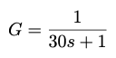
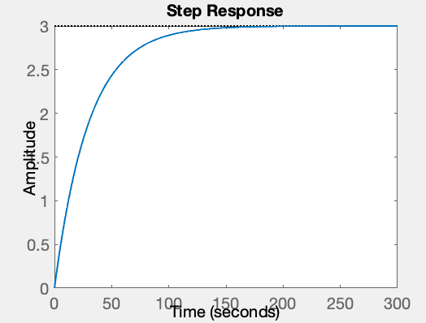
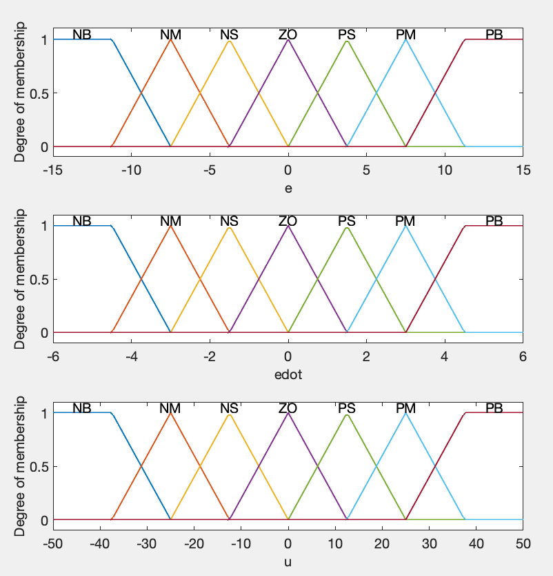
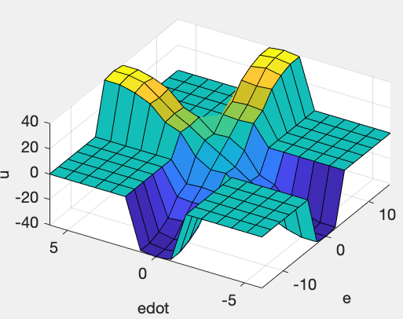
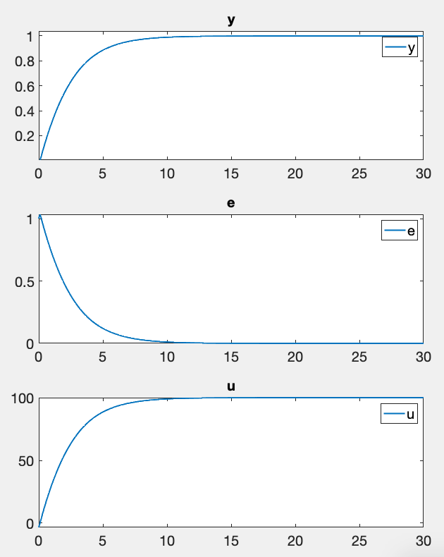

# Fuzzy-PID

### プラントの伝達関数





### メンバシップ関数


### ファジィ制御則
```
                   Description          
          ______________________________
    1     "e==ZO & edot==NB => u=NB (1)"
    2     "e==ZO & edot==NM => u=NM (1)"
    3     "e==ZO & edot==NS => u=NS (1)"
    4     "e==ZO & edot==ZO => u=ZO (1)"
    5     "e==ZO & edot==PS => u=PS (1)"
    6     "e==ZO & edot==PM => u=PM (1)"
    7     "e==ZO & edot==PB => u=PB (1)"
    8     "e==NB & edot==ZO => u=NB (1)"
    9     "e==NM & edot==ZO => u=NM (1)"
    10    "e==NS & edot==ZO => u=NS (1)"
    11    "e==PS & edot==ZO => u=PS (1)"
    12    "e==PM & edot==ZO => u=PM (1)"
    13    "e==PB & edot==ZO => u=PB (1)"
```
### サーフェスプロット


### 制御結果



